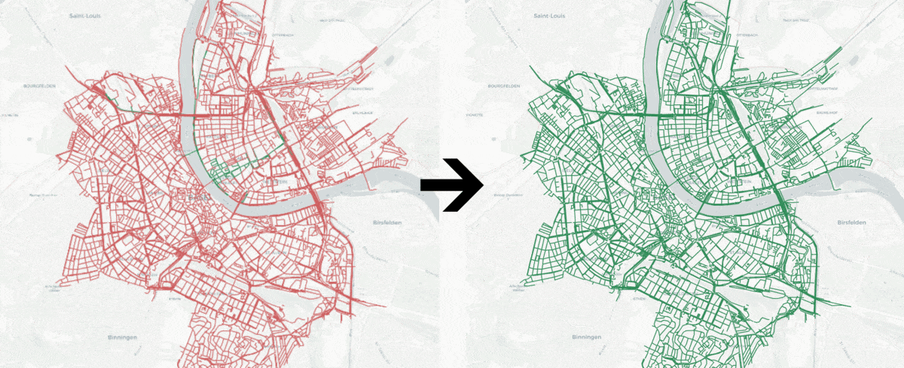
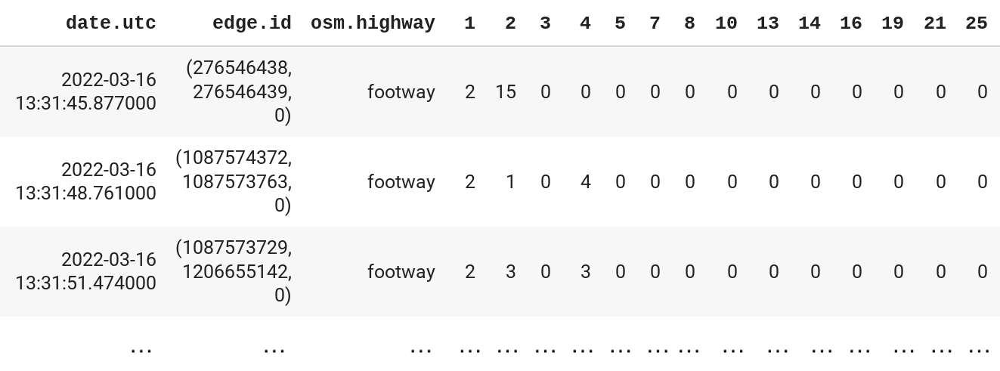

    
    &nbsp;&nbsp;&nbsp;&nbsp;&nbsp;&nbsp;&nbsp;&nbsp;&nbsp;&nbsp;
    

# Cortexia - Darkzones Prediction

This repository contains complete [SIT Academy](https://sit.academy/) students' final project, developed during July 2022.

The project was done in collaboration with the former students of SIT Academy Data Science Program and the Lead Data Scientist in Cortexia: Sustainable Clean City [Julien Dupon](https://www.linkedin.com/in/julien-dupont-rochat/).

[Cortexia](https://www.cortexia.ch/?lang=en) offers a world leading solution to efficiently clean cities while saving resources and preserving quality of drain water and landscape. Computer vision system mounted on sweepers detect and count the litters present on the streets. Measurements are done every day anywhere in the city. However, the coverage of moving cameras in space and time is rather low. In fact, a city would like to use only as many cameras as necessary for a satisfying estimation of the cleanliness. Since the amount of litter is dependent on common features, the idea is to sample partially a city and predict the remaining uncovered streets: the dark zones. Months of data recorded for the city of Basel are available and can be extended if required.

## Authors

[Dominik Bacher](https://www.linkedin.com/in/dominikbacher/),  [Valeria Rutskaia](https://www.linkedin.com/in/valeria-rutskaia/)

## Purpose 

The goal of the project is to predict counts of different types of litter in Darkzones. Each day approximately 40% of the streets of Basel are scanned and measured by Cortexia's image recognition system. For the remaining 60% of the streets, predictions are made with the Machine Learning algorithm developed in this project.

## Data

The data needed to find the Darkzones and predict litter counts for them are the readings performed by Cortexia's image recognition on street waste. The data should be a long-time frame (Recomended 12+ months) and must contain the following columns:
- `date_utc` : The date in which the litter count reading was performed
- `edge_id` : The edge number corresponding to the reading
- `osm_highway` : The type of street according to Open Street Maps
- *[litter counts]* : At least one column with litter counts with a numerical label (E.g. `21`)

The following is an example of how the raw dataframe should be:

## How to work with this repo

### Predicting Darkzones

The main script to create a Pandas dataframe with the predicted litter counts for the Darkzones is located in the `src` folder.
The following steps must be followed. For convenience, the notebook [example.ipynb](src/example.ipynb) also contains instructions.

#### Steps:

1. Create a Conda environment from the [environment.yml](environment.yml) file.
2. Create a Jupyter Notebook or Python script and activate the created environment.
3. Import pandas.
4. Import [darkzones](src/darkzones.py).
5. Declare a pandas.DataFrame containing data with the readings for litter counts. Must contain the following columns:
    - `date_utc` : The date in which the litter count reading was performed
    - `edge_id` : The edge number corresponding to the reading
    - `osm_highway` : The type of street according to Open Street Maps
    - *[litter counts]* : At least one column with litter counts with a numerical label (E.g. `21`)
6. **IMPORTANT**: The longer the time frame of the data, the better the prediction model will be. (Recommended 12+ months)
7. Declare a list with the numerical litters that want to be predicted.
8. Declare variable called `models` which calls the function [darkzones.train_models()](src/darkzones.py). Pass the following arguments:
    - pandas.DataFrame declared in step 5
    - litters list declared in step 7
9. Define a variable that calls the function [darkzones.predict_darkzones()](src/darkzones.py). Pass the following arguments:
    - pandas.DataFrame declared in step 5
    - models dictionary declared in step 8

Following these steps, a dataframe containing the edges for which in any given day from the time range of the original data that don't have litter count readings, will be created containing the predicted litter counts.

## Folder structure

### src

Contains the scripts to run the Darkzones prediction. See `How to work with this repo` for more information.

### notebooks

Contains the work performed during the project's duration in Jupyter Notebooks. It is not needed to create and predict the Darkzones, but it is a good resource to verify how we achieved the final project.

### docs

Contains the project's backlog, the workflow's journal and the comments provided by Cortexia.

### reports

Contains logs with information about scores for different models, hyperparameters, features and predicted litter types; graphs related to analysis of the data; scores of the model for different types of litter.
